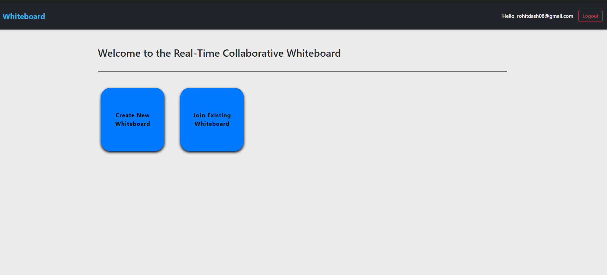
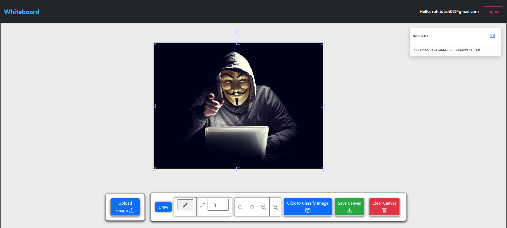
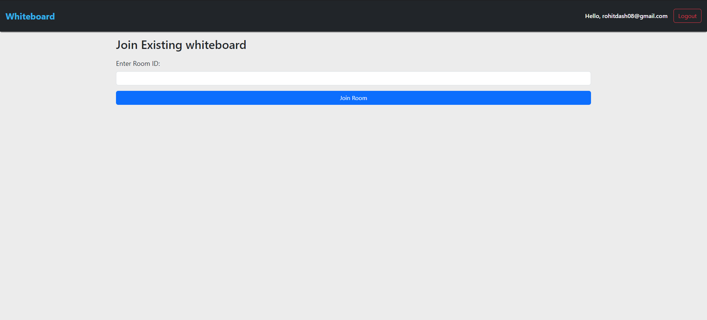
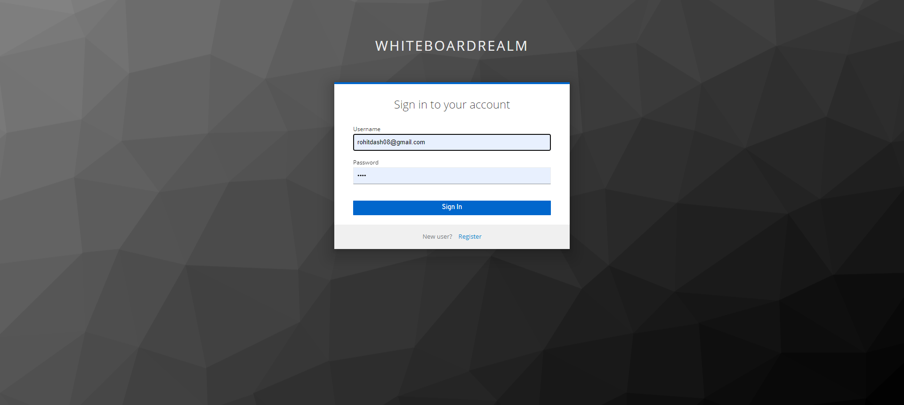

# Real-Time Collaborative Whiteboard

Welcome to the Real-time Collaborative Whiteboard! This application allows users to collaboratively draw and interact on a shared canvas in real-time.

## Demo

## Features

- **Real-Time Collaboration:** See other users drawings in real-time.
- **Zoom In/Out:** Zoom in and out for detailed or broad views of the canvas.
- **Undo/Redo:** Easily undo and redo drawing actions.
- **Save:** Save the whiteboard as an image or PDF, and classify images.
- **Keycloak Authentication** User Signup and login using keycloak.

# Installation

Follow these steps to set up the Project:

## Clone the Repository

git clone https://github.com/rohitdash08/Real-Time-Collaborative-Whiteboard.git

## Navigate to the porject directory

cd whiteboard-app

## Install dependencies

npm install

# To run the application

- **cd backend** node server.js
- **cd whitboard-app** npm start

# Technologies Used
React
Node.js
Express
Socket.io
Fabric.js
Bootstrap
Docker
